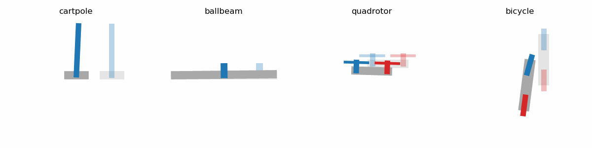

# control-toys
 
A collection of simple nonlinear dynamical systems with linear quadratic control

## Dependencies
- [NumPy](https://numpy.org/)
- [SciPy](https://www.scipy.org/)
- [Matplotlib](https://matplotlib.org/)
- [Autograd](https://github.com/HIPS/autograd)
